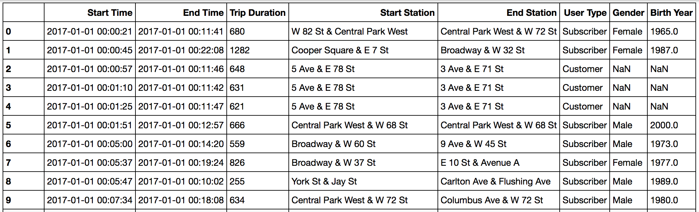
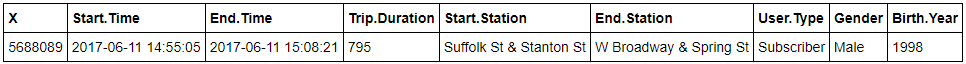
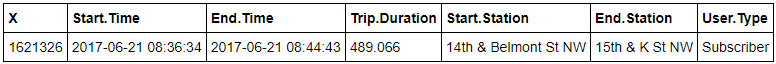
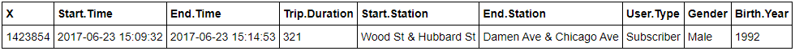
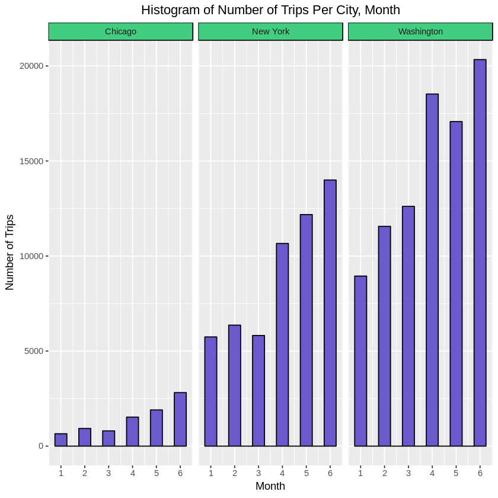
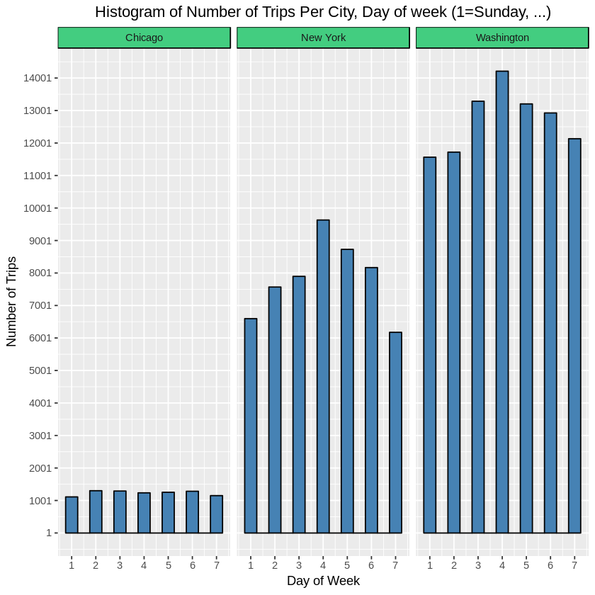
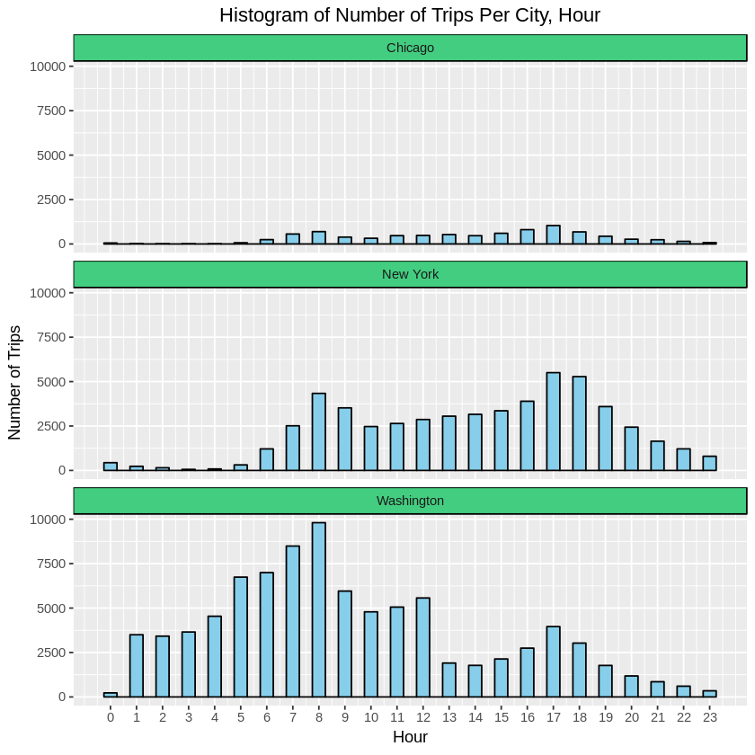
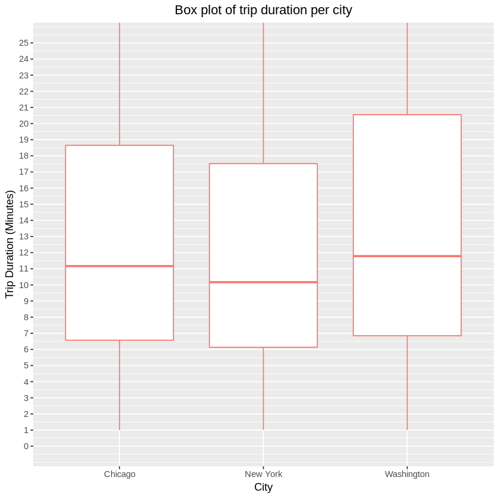
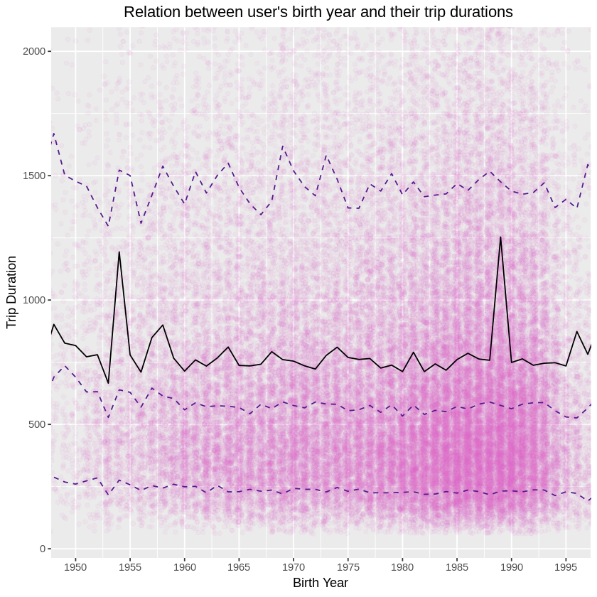

# Analysis of Bike Sahre Data

## Introduction
I've finished the : [Nonodegree Program: Programming for Data Science with R](https://learn.udacity.com/nanodegrees/nd118) at [Udacity](https://www.udacity.com) and this project was a part of my program study.


### Bike Share Data
Over the past decade, bicycle-sharing systems have been growing in number and popularity in cities across the world. Bicycle-sharing systems allow users to rent bicycles on a very short-term basis for a price. This allows people to borrow a bike from point A and return it at point B, though they can also return it to the same location if they'd like to just go for a ride. Regardless, each bike can serve several users per day.

In this project, I used data provided by [Motivate](https://motivateco.com/), a bike share system provider for many major cities in the United States, to uncover bike share usage patterns. I compared the system usage between three large cities: Chicago, New York City, and Washington, DC.

### Dataset
Randomly selected data for the first six months of 2017 are provided for all three cities. All three of the data files contain the same core six (6) columns:

- Start Time (e.g., 2017-01-01 00:07:57)
- End Time (e.g., 2017-01-01 00:20:53)
- Trip Duration (in seconds - e.g., 776)
- Start Station (e.g., Broadway & Barry Ave)
- End Station (e.g., Sedgwick St & North Ave)
- User Type (Subscriber or Customer)
- The Chicago and New York City files also have the 

following two columns:
- Gender
- Birth Year

The data is available at /data folder.



### Objective & Goals
**In this project, I answered the following questions:**
1) What are the most common month, day of week, and hour for traveling in each city?
2) What are the most frequently used start and end stations in each city?
3) How is the relation between user's age and their trip duration?
<br>

# Analysis

At first, I loaded required packages and data files and axplored them.

```r
# Loads ggplot2 
library(ggplot2)

# Loads lubridate 
library(lubridate)

# Loads stringr 
library(stringr)
```

```r
# Loads the bikeshare data from .csv files for three cities
ny = read.csv('data/new_york_city.csv')
wash = read.csv('data/washington.csv')
chi = read.csv('data/chicago.csv')
```

```r
# Shows the first row of New York city data
head(ny,1)
```


```r
# Shows the first row of Washington city data
head(wash,1)
```


```r
# Shows the first row of Chicago city data
head(chi,1)
```



## 1) What are the most common month, day of week, and hour for traveling in each city?

To answer this question first let`s look at the codes used to answer this question.

```r
# Extracts month from 'Start.Time' column and adds it to the dataframe as a new column: Start.Month .
all_data$Start.Date <- as.POSIXct(all_data$Start.Time)

all_data$Start.Month <- format(all_data$Start.Date, format = "%m")

# Extracts day of week from 'Start.Time' column and adds it to the dataframe as a new column: Start.Day .
# It indexes Sunday as '1'.
all_data$Start.Day <- wday(all_data$Start.Date)

# Extracts hour from 'Start.Time' column and adds it to the dataframe as a new column: Start.Hour .
all_data$Start.Hour <- format(all_data$Start.Date, format = "%H")

# Histogram of Number of Trips Per City, Month.
ggplot(aes(x=as.integer(Start.Month)), data=all_data) +
  geom_histogram(binwidth = 0.5, color = 'black', fill = 'slateblue') +
  ggtitle('Histogram of Number of Trips Per City, Month')  +
  labs(x = "Month", y = "Number of Trips") +
  scale_x_continuous(breaks = 1:6) +
  facet_wrap(~city) +
  theme(plot.title = element_text(hjust = 0.5), legend.position="none",
      strip.background=element_rect(colour="black", fill="seagreen3"))
```


As seen in the diagram above, month 6 is the most common in all three cities.

```r
# Histogram of Number of Trips Per City, Day of Week.
ggplot(aes(x=Start.Day), data=all_data) + 
  geom_histogram(binwidth = 0.5, color = 'black', fill = 'steelblue') +
  ggtitle('Histogram of Number of Trips Per City, Day of week (1=Sunday, ...)')  +
  labs(x = "Day of Week", y = "Number of Trips") +
  scale_x_continuous(breaks = 1:7) +
  scale_y_continuous(breaks = seq(1,15000,1000)) +
  facet_wrap(~city) +
  theme(plot.title = element_text(hjust = 0.5), legend.position="none",
      strip.background=element_rect(colour="black", fill="seagreen3"))
```


The above diagram shows us that Wendsday is the most popular in New York and Washington cities, but for Chicago, it's not clear, so we run another command to clear that.

```r
# Separates the data of Chicago, and then gets count for each DOW with 'Start.Day' column
table(subset(all_data, all_data$city == 'Chicago')$Start.Day)

```

```
1    2    3    4    5    6    7 
1111 1302 1292 1236 1254 1285 1150 
```
As observed, Monday is the most popular day in Chicago, however Monday, Tuesday, and Friday are all quite close together.

```r
# Histogram of Number of Trips Per City, Hour.
ggplot(aes(as.integer(x=Start.Hour)), data=all_data) +
  geom_histogram(binwidth = 0.5, color = 'black', fill = 'skyblue') +
  ggtitle('Histogram of Number of Trips Per City, Hour')  +
  labs(x = "Hour", y = "Number of Trips") +
  scale_x_continuous(breaks = 0:23) +
  facet_wrap(~city, ncol=1) +
  theme(plot.title = element_text(hjust = 0.5), legend.position="none",
      strip.background=element_rect(colour="black", fill="seagreen3"))
```


As seen in the diagram above, in Chicago and New York cities, 17:00 P.M. is the most popular, but in Washington, 8:00 A.M. is the most common.
<br>
<br>

## 2) What are the most frequently used start and end stations in each city?

To answer this question first let`s look at the codes used to answer this question.
```r
# Creates a new function to calculate Mode for input array.
getmode <- function(v) {
   uniqv <- unique(v)
   uniqv[which.max(tabulate(match(v, uniqv)))]
}

# Iterates three cities, and finds the most popular start and end stations for each of them.
for (curr_city in unique(all_data$city)) {    
  curr_city_data = subset(all_data, all_data$city == curr_city)
  
  cat(paste("\n\nThe most frequently used stations in ", curr_city, "--> "))  
    
  popular_start_station = getmode(curr_city_data$Start.Station)
  cat(paste("\nThe most popular start station: ", popular_start_station))

  popular_end_station = getmode(curr_city_data$End.Station)
  cat(paste("\nThe most popular end station: ", popular_end_station))
}
```

```
The most frequently used stations in  Chicago --> 
The most popular start station:  Streeter Dr & Grand Ave
The most popular end station:  Streeter Dr & Grand Ave

The most frequently used stations in  New York --> 
The most popular start station:  Pershing Square North
The most popular end station:  Pershing Square North

The most frequently used stations in  Washington --> 
The most popular start station:  Columbus Circle / Union Station
The most popular end station:  Columbus Circle / Union Station
```

What are the usual ranges of trips in each city?

```r
# Gets stats for Trip.Duration to config better Box Plot diagram.
summary(all_data$Trip.Duration)
```

```
Min. 1st Qu.  Median    Mean 3rd Qu.    Max.    NA's 
60     392     667    1098    1159 1088634       1 
```

```r
# Gets stats for Trip.Duration to config better Box Plot diagram.
by(subset(all_data, !is.na(Trip.Duration))$Trip.Duration, subset(all_data, !is.na(Trip.Duration))$city, median)
```

```
subset(all_data, !is.na(Trip.Duration))$city: Chicago
[1] 670
------------------------------------------------------------ 
subset(all_data, !is.na(Trip.Duration))$city: New York
[1] 610
------------------------------------------------------------ 
subset(all_data, !is.na(Trip.Duration))$city: Washington
[1] 706.991
```

```r
# Draws a Box Plot diagram for display the range of data.
qplot(x = city, y = Trip.Duration/60,
      data =subset(all_data, !is.na(Trip.Duration)), 
      geom = 'boxplot', color='seagreen') +

  ggtitle('Box plot of trip duration per city') +

  labs(x = "City", y="Trip Duration (Minutes)") +

  theme(plot.title = element_text(hjust = 0.5), legend.position='none') +
  coord_cartesian(ylim = c(0,25)) +
  scale_y_continuous(breaks = seq(0,25, 1))
```


As seen in the diagram above, 50% of trips in Chicago last 6.5 to 18.5 minutes, 50% in New York last 6 to 18 minutes, and 50% in Washington last 7 to 21 minutes.

Also, median of trip durations in Chicago is 11 minutes, in New York is 10 minutes, and in Washington is around 12 minuts.
<br>
<br>

## 3) How is the relation between user's age and their trip duration?

First, let`s look at the codes used to answer this question.

```r
# Gets stats for 'Birth.Year' column.
summary(all_data$Birth.Year)
```

```
Min. 1st Qu.  Median    Mean 3rd Qu.    Max.    NA's 
1885    1970    1981    1979    1988    2002   96015 
```

```r
# Gets stats for 'Trip.Duration' column.
summary(all_data$Trip.Duration)
```

```
Min. 1st Qu.  Median    Mean 3rd Qu.    Max.    NA's 
60     392     667    1098    1159 1088634       1 
```

```r
# Draws a Scatter Plot for show the relation between the user's birth year and their trip duration.
ggplot(aes(x = as.integer(Birth.Year), y = Trip.Duration), data = subset(all_data, !is.na(Birth.Year))) +
  
  ggtitle('Relation between user\'s birth year and their trip durations ') +

  labs(x = "Birth Year", y="Trip Duration") +

  theme(plot.title = element_text(hjust = 0.5)) +

  coord_cartesian(xlim = c(1950,1995), ylim = c(60,2000)) +

  geom_point(alpha=0.05, position = position_jitter(h=0), color = 'orchid') +

  scale_x_continuous(breaks = seq(1950,1995, 5)) +

  stat_summary (geom = "line", fun = 'mean') +
 
  stat_summary (geom = "line", fun.y = quantile, fun.args = list(probs = .1),
                linetype=2, color='purple4') +
  stat_summary (geom = "line", fun.y = quantile, fun.args = list(probs = .5),
                linetype=2, color='purple4') +   
  stat_summary (geom = "line", fun.y = quantile, fun.args = list(probs = .9),
               linetype=2, color='purple4')
```


As seen in the diagram above, the users's birth year, between 1980 to 1995, makes most of the data and we have a steady range for different quantiles, and there isn't meaningful relation between age and trip duration.
